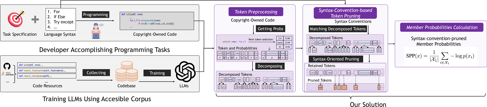

# SYNPRUNE

This is the official repository for the paper [Uncovering Pretraining Code in LLMs: A Syntax-Aware Attribution Approach](https://arxiv.org/pdf/2511.07033).

## Overview

We propose **SYNPRUNE**, a syntax-pruned membership inference attack method tailored for code, to detect whether specific code samples were included in the pretraining data of large language models (LLMs), addressing transparency, accountability, and copyright compliance issues in code LLMs. Unlike prior membership inference attack (MIA) methods that treat code as plain text, **SYNPRUNE** leverages the structured nature of programming languages by pruning consequent tokens dictated by syntax conventions (e.g., from Python's data models, expressions, statements), excluding them from attribution scores to improve detection accuracy. To evaluate pretraining data detection for code LLMs, we introduce a new [benchmark](https://huggingface.co/datasets/Sheerio/SynPrune-Python) of Python functions, sourced from the **Pile dataset** for members and post-2024 GitHub repositories for non-members.



## Benchmark

The [**Python Function Benchmark**](https://huggingface.co/datasets/Sheerio/SynPrune-Python) serves as a real-world evaluation dataset for membership inference attacks on code LLMs, specifically targeting models pretrained on datasets like the Pile (e.g., Pythia, GPT-Neo, StableLM).  

The dataset contains training (member) data and non-training (non-member):  

- **Member data** includes 1,000 Python functions sampled from the Pile dataset (released in 2021). To ensure a diverse sample, we systematically selected **the first 10 functions** from every 100 consecutive entries in the Pile, resulting in a total of 1,000 member functions.

- **Non-member data** includes 1,000 Python functions extracted from 100 GitHub repositories created after January 1, 2024 (all four evaluated LLMs had been released prior to this date). To ensure repository quality, we sorted repositories by star count in descending order and extracted 10 Python functions from each repository in order.
  To verify that these functions were genuinely original and not cloned from pre-existing sources, we implemented a rigorous verification process: we parsed each candidate function's code using Python's `ast` module to extract its name, variable names, and function calls, then used these elements to build search queries for the GitHub API. The verification employed three heuristics: (1) searching for the exact function name to identify direct duplicates; (2) searching by internal variable names to detect refactored code reuse; and (3) searching for the complete string of function calls to find logic similarities. Two authors conducted peer reviews on the search results to ensure all 1,000 functions were original and created after January 2024.

The benchmark includes 214 non-member function files (some repositories contributed multiple files) with an average of 25.34 lines of code (LOC). For member functions, file counts are unavailable as this information was not provided in the Pile dataset.

The benchmark supports evaluation under varied member-to-non-member **ratios** (e.g., 1:1, 1:5, 5:1) and includes statistics on syntax conventions (e.g., **38.4%** of tokens are syntax-related across categories like data models and expressions).  

Access our datasets directly on [https://huggingface.co/datasets/Sheerio/SynPrune-Python).


## 🔧 Environment Setup

First, install dependencies:

```bash
pip install -r requirements.txt
```

You are recommended to use **Python 3.10+** and a machine with GPU support for large language models like Pythia.

------

## 📂 Dataset Format

Your input dataset should be in `.jsonl` format, where each line is a JSON object:

```json
{"function": "def foo():\n    return 1", "label": 1}
```

- `"function"`: the raw Python code string to be scored
- `"label"`: binary label (0 or 1) used for computing AUROC and related metrics

Default file name is `python_sample.jsonl`, or you may specify it using `--dataset`.

## 🚀 How to Run

The main evaluation script is `run.py`. You can execute it as follows:

```bash
python run.py \
  --model EleutherAI/pythia-2.8b \
  --dataset python_sample.jsonl
```

### Optional arguments:

- `--half`: enable bfloat16 inference (recommended if your GPU supports it)
- `--int8`: use 8-bit inference (requires `bitsandbytes`)
- `--max_length`: maximum sequence length (default is 512)

get more info from ./src/README.md

## 📊 Output

After running, a table will be printed to the console showing the evaluation metrics:

- **AUROC**: Area under the ROC curve
- **FPR@95**: False Positive Rate at 95% TPR
- **TPR@5**: True Positive Rate at 5% FPR

The script currently computes and logs scores for:

- `loss`: model negative log-likelihood
- `zlib`: compression-normalized log-likelihood
- `mink_0.2`: bottom-20% average log-probability (unmasked)
- `synprune`: masked average log-probability using a syntax-based pruning mask

get more info from ./src/README.md

## 🚀 How to Replicate

See the **./src/replicate.ipynb**

## evaluate

### ablate.py

This script runs **ablation experiments** for the SynPrune method.
It loads a Python function dataset and a language model, applies a **syntax-based masking strategy** where specific categories of syntax tokens (Data Model, Expressions, Single Statements, Compound Statements) can be selectively excluded via the `--drop` parameter, computes SynPrune scores, and outputs the corresponding performance metrics (AUROC, FPR\@95, TPR\@5).
It also saves results for each ablation setting to a CSV file for later analysis.

### visualization.py

This script loads a specified Python code dataset and a language model, computes **SynPrune** scores for each sample using a syntax-based token masking strategy, and outputs classification performance metrics such as AUROC and the best F1-score threshold.
It can also plot the **F1-score curve** across different thresholds, either saving it as an image file or displaying it directly, allowing intuitive analysis of the model’s performance under varying thresholds.

## 📌 Notes

- The script uses HuggingFace Transformers to load and run causal language models.
- You can replace `EleutherAI/pythia-2.8b` with any other HuggingFace CausalLM model (e.g., `gpt6j`, etc.).
- `synprune` is sensitive to syntax-based token masking. You can adapt the pruning rules in `get_closing_token_mask()`.

## Citation

If you find this work helpful, please consider citing our paper:

```latex
@misc{li2025synprune,
    title={Uncovering Pretraining Code in LLMs: A Syntax-Aware Attribution Approach},
    author={Yuanheng Li and Zhuoyang Chen and Xiaoyun Liu and Yuhao Wang and Mingwei Liu and Yang Shi and Kaifeng Huang and Shengjie Zhao},
    year={2025},
    eprint={2511.07033},
    archivePrefix={arXiv},
    primaryClass={cs.CR}
}
```