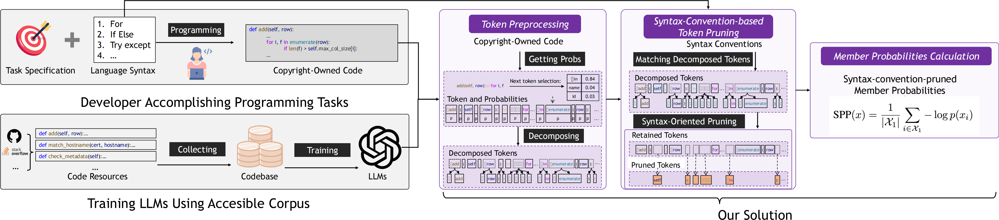

# SYNPRUNE
This is the official repository for the paper Uncovering Pretraining Code in LLMs: A Syntax-Aware Attribution Approach by *Kaifeng Huang, Yuanheng Li, Zhuoyang Chen, Xiaoyun Liu...*

## Overview

We propose **SYNPRUNE**, a syntax-pruned membership inference attack method tailored for code, to detect whether specific code samples were included in the pretraining data of large language models (LLMs), addressing transparency, accountability, and copyright compliance issues in code LLMs. Unlike prior membership inference attack (MIA) methods that treat code as plain text, **SYNPRUNE** leverages the structured nature of programming languages by pruning consequent tokens dictated by syntax conventions (e.g., from Python's data models, expressions, statements), excluding them from attribution scores to improve detection accuracy. To evaluate pretraining data detection for code LLMs, we introduce a new benchmark of Python functions, sourced from the **Pile dataset** for members and post-2024 GitHub repositories for non-members.

## Benchmark

The **Python Function Benchmark** serves as a real-world evaluation dataset for membership inference attacks on code LLMs, specifically targeting models pretrained on datasets like the Pile (e.g., Pythia, GPT-Neo, StableLM).  

The dataset contains non-training (non-member) and training (member) data:  

- **Non-member data** includes 1000 Python functions extracted from 214 GitHub repositories created after January 1, 2024 (post-release cutoff for evaluated LLMs), verified for originality using heuristics like function name searches, variable name checks, and logic similarity detection via GitHub API.  
- **Member data** includes 1000 Python functions randomly sampled from the Pile dataset (released in 2021), which is widely used in LLM pretraining.  

The benchmark supports evaluation under varied member-to-non-member **ratios** (e.g., 1:1, 1:5, 5:1) and includes statistics on syntax conventions (e.g., **38.4%** of tokens are syntax-related across categories like data models and expressions).  
